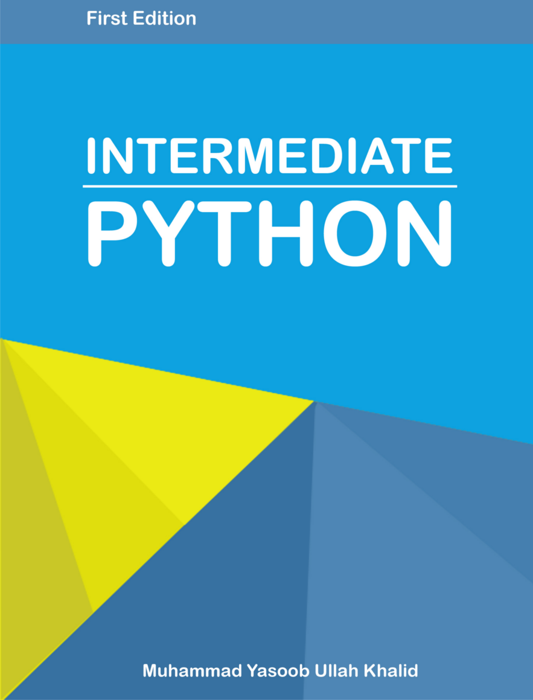

Intermediate Python
===================

파이썬은 강력하고 프로그래머들의 커뮤니티와 친숙한 놀라운 언어입니다. 그러나,
Python의 기본을 공부한 이후의 문서가 부족합니다. 이 책은 그러한 문제점을 해결
하기 위해서 만들어진 문서입니다. 여러분이 보고 더 발전할 수 있는 흥미로운 주제들을 가져왔습니다. 

이 책에 있는 토픽들은 당신의 생각을 변화 시킬것입니다. 이 책은 내가 처음
파이썬을 배웠을때와 같은 열정을 끄집어낼 것입니다.

당신이 beginner, intermediate 혹은 advanced 이상의 프로그래머여도 이 책에서
무언가를 얻어 갈 수 있을것입니다.

이 책은 튜토리얼이 아니며 파이썬을 가르치려는 책이 아니라는 점을 명심 해
주세요. 각 토픽에 대해서 깊게 설명하지 않고 최소한의 필요한 부분만을 적어
두었습니다.

이것을 보면 여러분도 나처럼 흥미로울 것이라고 생각합니다. 그럼 시작 합니다!

Note: 이 책은 진행 중인 책입니다. 당신을 더 향상 시킬수 있는 무엇인가를
발견하면 pull request를 보내주세요 :)

또한, 이 책에 컨텐츠를 더 추가 하고 싶다면 pull request를 보내주시면 기쁜
마음으로 추가 할 것 입니다.

-------------------

**Note**: 이 책을 구매 하고싶다면
[Gumroad](https://gum.com/intermediate_python) 에서 구매가 가능합니다. 또한 이
책이 당신에게 어떻게든 도움이 되었다면 [이곳](mailtoyasoob.khld@gmail.com) 으로
당신의 경험을 공유해주세요. 저에게 굉장히 기쁠 것입니다??

-------------------

목차:
-----
1) 프로그래밍 도구들

- [Virtual Environment](virtual_environment.rst)
- [Debugging](debugging.rst)
- [Objet introspection](object_introspection.rst)

2) 문법

- [Exceptions](exceptions.rst)
- [For - Else](for_-_else.rst)
- [Ternary Operators](ternary_operators.rst)
- [Global & Return](global_&_return.rst)
- [Open function](open_function.rst)
- [\*args and \*\*kwargs](args_and_kwargs.rst)
- [Context managers](context_managers.rst)

3) 함수형 프로그래밍

- [Enumerate](enumerate.rst)
- [Lambdas](lambdas.rst)
- [``set`` Data Structure](set_-_data_structure.rst)
- [Map & Filter](map_filter.rst)
- [Comprehensions](comprehensions.rst)

4) Data structures

- [Generators](generators.rst)
- [Coroutines](coroutines.rst)

5) Data types

- [Collections](collections.rst)
- [Mutation](mutation.rst)
- [\_\_slots\_\_ Magic](__slots__magic.rst)

6) Decorators

- [What is a decorator?](decorators.rst)
- [Function caching](function_caching.rst)

7) Extras

- [One Liners](one_liners.rst)
- [Targeting Python 2+3](targeting_python_2_3.rst)
- [Python C extensions](python_c_extension.rst)

저자:
------

- [Muhammad Yasoob Ullah Khalid](https://github.com/yasoob)

기여자:
----------------

- [Philipp Hagemeister](https://github.com/phihag):

Philipp은 Open function챕터를 작성해 주었습니다. 고마워요 Philipp! :+1:

License:
-------
이 책은 [CC license(CC-By-NC-SA 4.0)](http://creativecommons.org/licenses/by-nc-sa/4.0/)를 따르고 있습니다.

이 책을 누군가에게 사용 혹은 추천을 하신다면 저에게 알려주세요 :smile:
